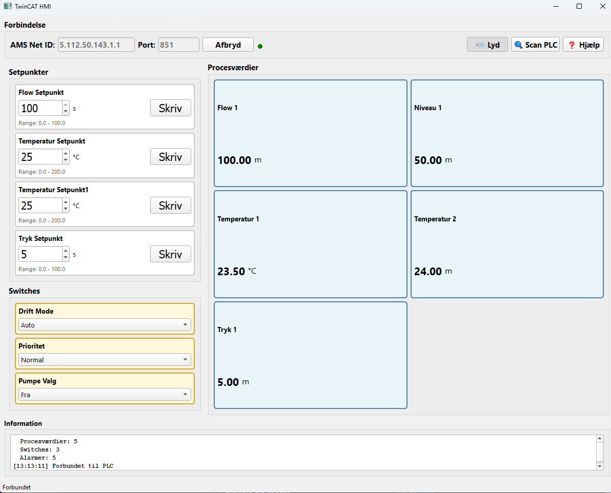

# TwinCAT HMI Application

Windows HMI application for TwinCAT 3 PLC communication via ADS protocol with automatic TMC metadata integration and comprehensive alarm system.

## 🎯 Key Features

- ✅ **Automatic TMC Metadata Loading** - All attributes loaded directly from TwinCAT TMC file
- ✅ **100% Accurate Metadata** - Switch labels, units, alarm texts from PLC code
- ✅ **ADS Communication** - Direct TwinCAT 3 integration via pyads
- ✅ **Automatic Symbol Discovery** - No manual configuration needed
- ✅ **4-Level Alarm System** - Critical, High, Medium, Low priorities
- ✅ **Alarm Logging** - CSV logging with history window
- ✅ **Live Updates** - Real-time PLC data monitoring

## 🚀 Quick Start

### 1. Installation
```powershell
py -m pip install pyads PyQt5
```

### 2. Configuration
Update `config.json` with your PLC address and TMC file path:
```json
{
  "ads": {
    "ams_net_id": "5.112.50.143.1.1",
    "ams_port": 851
  },
  "tmc_file": "C:\\Path\\To\\Your\\Project\\PLC\\PLC.tmc"
}
```

### 3. Run
```powershell
py main.py
```

HMI automatically loads all metadata from TMC file - no manual configuration needed!

## 📋 TMC Metadata Integration

### What is TMC?
TMC (Type Management Component) files contain **all** PLC code attributes:
- Switch position labels (Pos0, Pos1, Pos2)
- Units (°C, bar, L/min)
- Min/Max/Decimals/Step values
- Alarm texts and limits
- Priority levels

### Workflow
```
1. Write PLC code with attributes
2. Compile TwinCAT project → Generates PLC.tmc
3. Start HMI → Auto-loads metadata from TMC
4. Done! All labels and units correct
```

See [TMC_METADATA.md](TMC_METADATA.md) for detailed documentation.

## 🏭 PLC Code Example

## 🏭 PLC Code Example

```iecst
PROGRAM GVL
VAR_GLOBAL
    // Setpoint with complete metadata
    {attribute 'HMI_SP'}
    {attribute 'Unit' := '°C'}
    {attribute 'Min' := '0'}
    {attribute 'Max' := '100'}
    {attribute 'Decimals' := '1'}
    {attribute 'Step' := '0.5'}
    {attribute 'AlarmHighHigh' := '95'}
    {attribute 'AlarmHigh' := '85'}
    TemperaturSetpunkt : REAL := 25.0;
    
    // Process value with alarms
    {attribute 'HMI_PV'}
    {attribute 'Unit' := '°C'}
    {attribute 'Decimals' := '2'}
    {attribute 'AlarmHigh' := '90'}
    {attribute 'AlarmLow' := '5'}
    Temperatur_1 : REAL := 23.5;
    
    // Switch with custom labels
    {attribute 'HMI_SWITCH'}
    {attribute 'Pos0' := 'Stop'}
    {attribute 'Pos1' := 'Auto'}
    {attribute 'Pos2' := 'Manuel'}
    DriftMode : INT := 0;
    
    // Digital alarm
    {attribute 'HMI_ALARM'}
    {attribute 'AlarmText' := 'Motor 1 Fejl'}
    {attribute 'AlarmPriority' := '1'}
    Motor1Fejl : BOOL := FALSE;
END_VAR
END_PROGRAM
```

Compile TwinCAT project, and HMI automatically loads all attributes!

## 📁 Project Structure

```
Easy_TwincatHMI/
├── main.py                      # Main application
├── config.json                  # Configuration with TMC path
│
├── ads_client.py                # ADS communication
├── ads_symbol_parser.py         # Symbol parsing
├── alarm_manager.py             # Alarm logic
├── alarm_logger.py              # CSV logging
├── gui_panels.py                # UI panels
│
├── tmc_parser.py                # TMC XML parser
├── tmc_config_generator.py      # Config generator
│
└── TMC_METADATA.md              # TMC integration docs
```

## 🛠️ Tools

### TMC Parser
View all symbols in TMC file:
```powershell
py tmc_parser.py "C:\Path\To\PLC.tmc"
```

### Config Generator
Generate complete config from TMC:
```powershell
py tmc_config_generator.py "C:\Path\To\PLC.tmc" config.json
```

## 🔄 Updating Metadata

When you change PLC code:

1. **Edit attributes in TwinCAT**
2. **Compile project** (F7) - Updates TMC file
3. **Restart HMI** - Metadata updated automatically!

No manual configuration needed - TMC file is the single source of truth.

## 📚 Documentation

- **[TMC_METADATA.md](TMC_METADATA.md)** - Complete TMC integration guide
- **[QUICKSTART.md](QUICKSTART.md)** - Quick start guide
- **[PROJECT_OVERVIEW.md](PROJECT_OVERVIEW.md)** - Project architecture

## 🚨 Alarm System

### 4 Priority Levels
1. **Critical** (Red) - Emergency alarms
2. **High** (Orange) - High priority warnings  
3. **Medium** (Yellow) - Medium priority warnings
4. **Low** (Gray) - Information/maintenance

### Features
- Analog alarms with High/Low/HighHigh/LowLow limits
- Digital alarm inputs (BOOL)
- Alarm acknowledgment
- CSV logging with timestamps
- Alarm history window

## 🔧 Troubleshooting

### TMC File Not Found
```
ERROR: TMC file not found: C:\path\to\PLC.tmc
```
**Solution**: 
1. Check path in `config.json`
2. Compile TwinCAT project
3. Verify TMC file exists

### No Symbols Found
```
Found 0 HMI symbols in TMC
```
**Solution**:
1. Add `{attribute 'HMI_SP'}` etc. to PLC code
2. Compile TwinCAT project
3. Test with: `py tmc_parser.py "path\to\PLC.tmc"`

### Connection Failed
```
Connection failed: Timeout
```
**Solution**:
1. Verify PLC is running
2. Check AMS Net ID in config.json
3. Test network: `ping <PLC_IP>`

## 📊 Performance

- **Startup time**: ~1 second for 20 symbols
- **TMC parsing**: ~50-100ms
- **Update rate**: 1Hz (configurable)
- **Memory**: ~50MB

## 💡 Advantages of TMC Integration

| Method | Pros | Cons |
|--------|------|------|
| **TMC Parsing** | ✅ 100% complete metadata<br>✅ Auto-sync with PLC<br>✅ No duplication | ⚠️ Requires TMC file access |
| **ADS Runtime** | ✅ Direct from PLC | ❌ Attributes not exported<br>❌ Only name/type/comment |
| **Manual Config** | ✅ Full control | ❌ Data duplication<br>❌ Manual maintenance |

## 📝 License

Internal use with TwinCAT 3 PLC systems.

## 🤝 Contributing

For questions or improvements, contact the development team.
python main.py
```

## Build EXE

```bash
build_exe.bat
```

## Alarm System

### Alarm Types
- **HighHigh (HH)**: Critical high alarm
- **High (H)**: Warning high
- **Low (L)**: Warning low
- **LowLow (LL)**: Critical low alarm
- **Digital**: BOOL-based alarms

### Alarm Priorities
- Priority 1: CRITICAL (Red, ⛔)
- Priority 2: HIGH (Orange, ⚠️)
- Priority 3: MEDIUM (Yellow, ⚡)
- Priority 4: LOW (Blue, ℹ️)

### Alarm States
- **ACTIVE**: Alarm is currently active
- **ACKNOWLEDGED**: Alarm acknowledged but still active
- **CLEARED**: Alarm condition resolved (history)

## License

MIT License


## UI PIC
